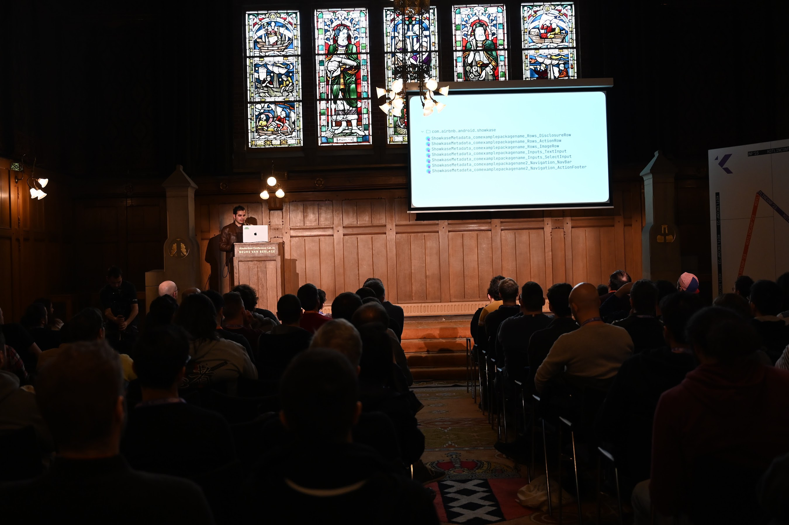
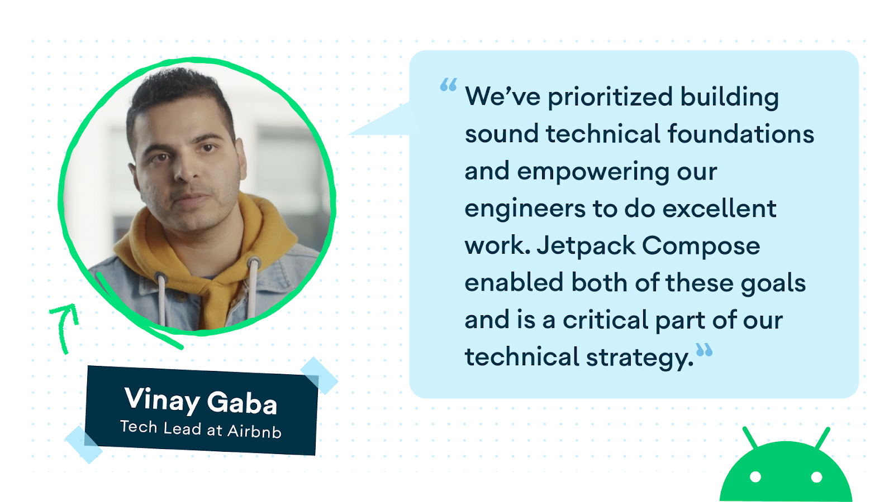
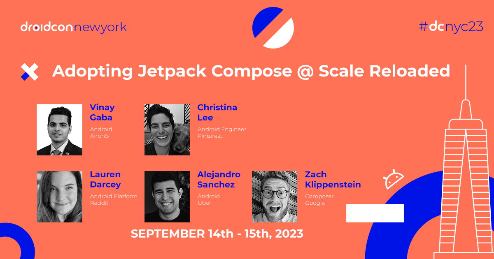

## Hi, I'm Vinay Gaba 👋

> I generally build things that run in your pocket 📱 and work at the intersection of code & design.

I'm an Engineering Leader with a lot of experience in building world-class consumer products. **I've helped build some of your favorite products such as Airbnb, Snapchat & Spotify**.

I live in sunny California with my lovely wife and daughter. I began my career in India before moving to the United States to pursue a Master's in Computer Science at Columbia University.

**I currently lead an ambitious AI-first team at Airbnb** that maintains critical pieces of our Product Infrastructure, focusing on transforming ideas right from design to code and helping us ship high-quality products faster. I'm biased, but I genuinely believe that we are on the cutting edge of product development and work on some of the most interesting problems in the industry.

The bulk of my career has been laser-focused on the mobile ecosystem. In recognition of my work, I've been acknowledged as a **Google Developer Expert for Android**. I enjoy sharing insights on topics that interest me through my [talks & writing](https://www.vinaygaba.me/writing/). I've also been fortunate to have my work featured and discussed by [leading publications and industry leaders](https://www.vinaygaba.me/appearances/).

You will always find me chipping away on one of my projects. **A few of my notable creations include [Showkase](https://github.com/airbnb/Showkase), [JetpackCompose.app](https://jetpackcompose.app/), [MakerOS](https://vinaygaba.gumroad.com/l/MakerOS) & [Learn Jetpack Compose By Example](https://github.com/vinaygaba/Learn-Jetpack-Compose-By-Example)**. Working on these projects gives me a lot of joy and is my idea of a perfect Sunday 😅 **I also write a popular Android/Compose focused newsletter called [Dispatch](https://www.jetpackcompose.app/newsletter) that's read by the top Android developers in the industry**.

My website is a good way to learn more about me - https://www.vinaygaba.me

## Media & Appearances

Here's a small selection of my body of work. You can find a lot more details on my [personal website](https://www.vinaygaba.me):

|                                                                                                                                                                                     |                                                                                                                                                                           |                                                                                                                                                        |
| :---------------------------------------------------------------------------------------------------------------------------------------------------------------------------------: | :-----------------------------------------------------------------------------------------------------------------------------------------------------------------------: | :----------------------------------------------------------------------------------------------------------------------------------------------------: |
|                           Techie Tuesdays: Vinay Gaba's Journey (Yourstory, 2021)                         |    Fireside Chat at Google's Internal Conference - Mobile Week (Google, 2024) |    Jetpack Compose @ Airbnb (Android Developers Blog, 2022) |
|                Automating UI Infrastructure in Jetpack Compose (KotlinConf, 2023)              |                 Jetpack Compose Panel Discussion (Droidcon Americas, 2020)              |            Cover of the June 2021 Edition (CODE Magazine, 2021)         |
|    Airbnb uses Jetpack Compose to empower devs to do their best work (Android Developers Blog, 2022) |              Adopting Jetpack Compose @ Scale Reloaded (Droidcon NYC, 2023)           |           Architecture Agnostic UI Development (Droidcon SF, 2019)        |
